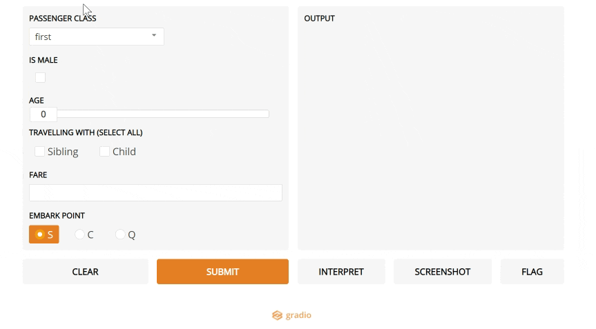
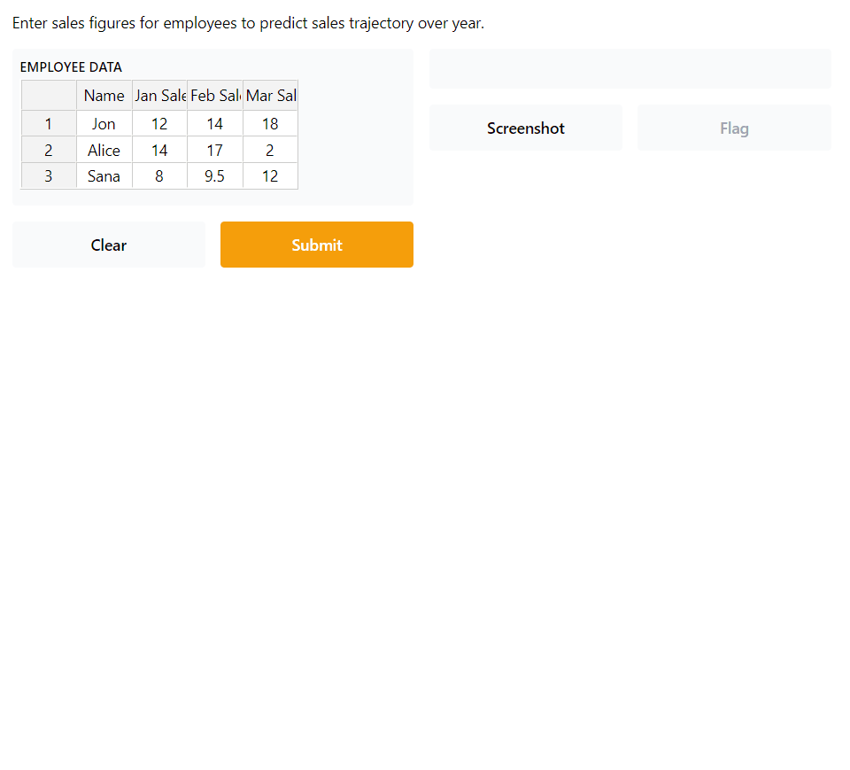
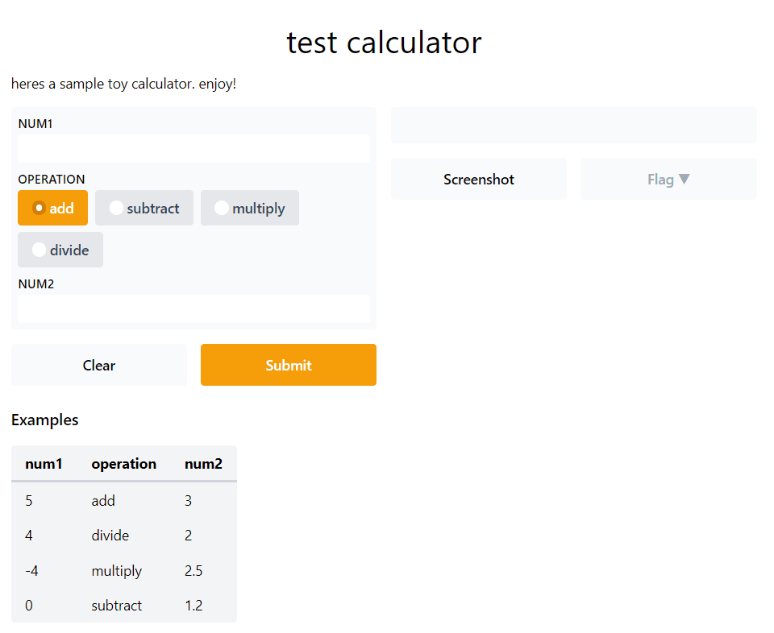
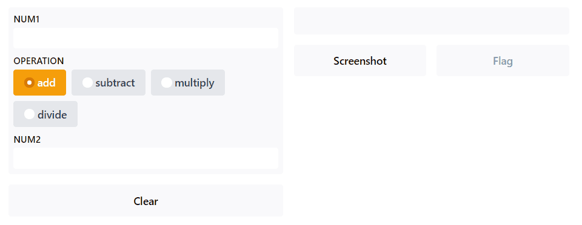
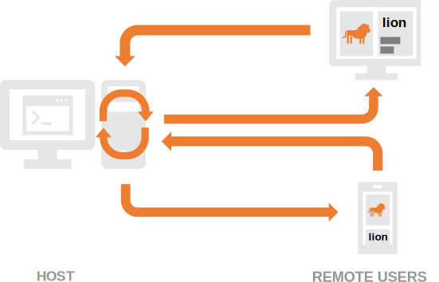

[](https://circleci.com/gh/gradio-app/gradio)  [](https://badge.fury.io/py/gradio)

#  Welcome to Gradio

Quickly create customizable UI components around your models. Gradio makes it easy for you to "play around" with your model in your browser by dragging-and-dropping in your own images, pasting your own text, recording your own voice, etc. and seeing what the model outputs.  



Gradio is useful for:

* Creating demos of your machine learning code for clients / collaborators / users

* Getting feedback on model performance from users

* Debugging your model interactively during development

**You can find an interactive version of the following Getting Started at [https://gradio.app/getting_started](https://gradio.app/getting_started).**


## Getting Started

### Quick Start

To get Gradio running with a simple example, follow these three steps:

<span>1.</span> Install Gradio from pip.

```bash
pip install gradio
```

<span>2.</span> Run the code below as a Python script or in a Python notebook (or in a  [colab notebook](https://colab.research.google.com/drive/18ODkJvyxHutTN0P5APWyGFO_xwNcgHDZ?usp=sharing)).

```python
import gradio as gr

def greet(name):
  return "Hello " + name + "!!"

iface = gr.Interface(fn=greet, inputs="text", outputs="text")
iface.launch()

```

<span>3.</span> The interface below will appear automatically within the Python notebook, or pop in a browser on  [http://localhost:7860](http://localhost:7860/)  if running from a script.


### The Interface

Gradio can wrap almost any Python function with an easy to use interface. That function could be anything from a simple tax calculator to a pretrained model.

The core  `Interface`  class is initialized with three parameters:

-   `fn`: the function to wrap
-   `inputs`: the input component type(s)
-   `outputs`: the output component type(s)

With these three arguments, we can quickly create interfaces and  `launch()`  them. But what if you want to change how the UI components look or behave?

### Customizable Components

What if we wanted to customize the input text field - for example, we wanted it to be larger and have a text hint? If we use the actual input class for  `Textbox`  instead of using the string shortcut, we have access to much more customizability. To see a list of all the components we support and how you can customize them, check out the [Docs](https://gradio.app/docs)

```python
import gradio as gr

def greet(name):
  return "Hello " + name + "!"

iface = gr.Interface(
  fn=greet, 
  inputs=gr.inputs.Textbox(lines=2, placeholder="Name Here..."), 
  outputs="text")
iface.launch()
```


### Multiple Inputs and Outputs

Let's say we had a much more complex function, with multiple inputs and outputs. In the example below, we have a function that takes a string, boolean, and number, and returns a string and number. Take a look how we pass a list of input and output components.

```python
import gradio as gr

def greet(name, is_morning, temperature):
  salutation = "Good morning" if is_morning else "Good evening"
  greeting = "%s %s. It is %s degrees today" % (
    salutation, name, temperature)
  celsius = (temperature - 32) * 5 / 9
  return greeting, round(celsius, 2)

iface = gr.Interface(
  fn=greet, 
  inputs=["text", "checkbox", gr.inputs.Slider(0, 100)],
  outputs=["text", "number"])
iface.launch()
```


We simply wrap the components in a list. Furthermore, if we wanted to compare multiple functions that have the same input and return types, we can even pass a list of functions for quick comparison.

### Working with Images

Let's try an image to image function. When using the  `Image`  component, your function will receive a numpy array of your specified size, with the shape  `(width, height, 3)`, where the last dimension represents the RGB values. We'll return an image as well in the form of a numpy array.

```python
import gradio as gr
import numpy as np

def sepia(input_img):
  sepia_filter = np.array([[.393, .769, .189],
                           [.349, .686, .168],
                           [.272, .534, .131]])
  sepia_img = input_img.dot(sepia_filter.T)
  sepia_img /= sepia_img.max()                          
  return sepia_img

iface = gr.Interface(sepia, gr.inputs.Image(shape=(200, 200)), "image")

iface.launch()
```


Additionally, our  `Image`  input interface comes with an 'edit' button which opens tools for cropping, flipping, rotating, drawing over, and applying filters to images. We've found that manipulating images in this way will often reveal hidden flaws in a model.

In addition to images, Gradio supports other media input types, such as audio or video uploads. Read about these in the [Docs](https://gradio.app/docs).

### Working with Data

You can use Gradio to support inputs and outputs from your typical data libraries, such as numpy arrays, pandas dataframes, and plotly graphs. Take a look at the demo below (ignore the complicated data manipulation in the function!)

```python
import gradio as gr
import numpy as np
import pandas as pd
import matplotlib.pyplot as plt

def sales_projections(employee_data):
    sales_data = employee_data.iloc[:, 1:4].astype("int").to_numpy()
    regression_values = np.apply_along_axis(lambda row: 
        np.array(np.poly1d(np.polyfit([0,1,2], row, 2))), 0, sales_data)
    projected_months = np.repeat(np.expand_dims(
        np.arange(3,12), 0), len(sales_data), axis=0)
    projected_values = np.array([
        month * month * regression[0] + month * regression[1] + regression[2]
        for month, regression in zip(projected_months, regression_values)])
    plt.plot(projected_values.T)
    plt.legend(employee_data["Name"])
    return employee_data, plt.gcf(), regression_values

iface = gr.Interface(sales_projections, 
    gr.inputs.Dataframe(
        headers=["Name", "Jan Sales", "Feb Sales", "Mar Sales"],
        default=[["Jon", 12, 14, 18], ["Alice", 14, 17, 2], ["Sana", 8, 9.5, 12]]
    ),
    [
        "dataframe",
        "plot",
        "numpy"
    ],
    description="Enter sales figures for employees to predict sales trajectory over year."
)
iface.launch()

```


### Example Inputs

You can provide example data that a user can easily load into the model. This can be helpful to demonstrate the types of inputs the model expects, as well as to provide a way to explore your dataset in conjunction with your model. To load example data, you provide a **nested list** to the  `examples=`  keyword argument of the Interface constructor. Each sublist within the outer list represents a data sample, and each element within the sublist represents an input for each input component. The format of example data for each component is specified in the  [Docs](https://gradio.app/docs).

```python
import gradio as gr

def calculator(num1, operation, num2):
    if operation == "add":
        return num1 + num2
    elif operation == "subtract":
        return num1 - num2
    elif operation == "multiply":
        return num1 * num2
    elif operation == "divide":
        return num1 / num2

iface = gr.Interface(calculator, 
    ["number", gr.inputs.Radio(["add", "subtract", "multiply", "divide"]), "number"],
    "number",
    examples=[
        [5, "add", 3],
        [4, "divide", 2],
        [-4, "multiply", 2.5],
        [0, "subtract", 1.2],
    ],
    title="test calculator",
    description="heres a sample toy calculator. enjoy!",
    flagging_options=["this", "or", "that"],
)

iface.launch()

```


You can load a large dataset into the examples to browse and interact with the dataset through Gradio. The examples will be automatically paginated (you can configure this through the `examples_per_page` argument of Interface) and you can use CTRL + arrow keys to navigate through the examples quickly.

### Live Interfaces

You can make interfaces automatically responsive by setting `live=True` in the interface. Now the interface will recalculate as soon as the user input.

```python
import gradio as gr

def calculator(num1, operation, num2):
    if operation == "add":
        return num1 + num2
    elif operation == "subtract":
        return num1 - num2
    elif operation == "multiply":
        return num1 * num2
    elif operation == "divide":
        return num1 / num2

iface = gr.Interface(calculator, 
    ["number", gr.inputs.Radio(["add", "subtract", "multiply", "divide"]), "number"],
    "number",
    live=True
)

iface.launch()

```


Note there is no submit button, because the interface resubmits automatically on change.

### Using State

Your function may use data that persists beyond a single function call. If the data is something accessible to all function calls, you can create a global variable outside the function call and access it inside the function. For example, you may load a large model outside the function and use it inside the function so that every function call does not need to reload the model.

Another type of data persistence Gradio supports is session state, where data persists across multiple submits within a page load. To store data with this permanence, use `gr.get_state` and `gr.set_state` methods.

```python
import gradio as gr
import random

def chat(message):
    history = gr.get_state() or []
    if message.startswith("How many"):
        response = random.randint(1,10)
    elif message.startswith("How"):
        response = random.choice(["Great", "Good", "Okay", "Bad"])
    elif message.startswith("Where"):
        response = random.choice(["Here", "There", "Somewhere"])
    else:
        response = "I don't know"
    history.append((message, response))
    gr.set_state(history)
    html = "<div class='chatbot'>"
    for user_msg, resp_msg in history:
        html += f"<div class='user_msg'>{user_msg}</div>"
        html += f"<div class='resp_msg'>{resp_msg}</div>"
    html += "</div>"
    return html

iface = gr.Interface(chat, "text", "html", css="""
    .chatbox {display:flex;flex-direction:column}
    .user_msg, .resp_msg {padding:4px;margin-bottom:4px;border-radius:4px;width:80%}
    .user_msg {background-color:cornflowerblue;color:white;align-self:start}
    .resp_msg {background-color:lightgray;align-self:self-end}
""", allow_screenshot=False, allow_flagging=False)
iface.launch()
```


Notice how the state persists across submits within each page, but the state is not shared between the two pages.

### Flagging

Underneath the output interfaces, there is a button marked "Flag". When a user testing your model sees input with interesting output, such as erroneous or unexpected model behaviour, they can flag the input for the interface creator to review. Within the directory provided by the  `flagging_dir=`  argument to the Interface constructor, a CSV file will log the flagged inputs. If the interface involves file data, such as for Image and Audio components, folders will be created to store those flagged data as well.

For example, with the calculator interface shown above, we would have the flagged data stored in the flagged directory shown below:

```directory
+-- calculator.py
+-- flagged/
|   +-- logs.csv
```

*flagged/logs.csv*
```csv
num1,operation,num2,Output
5,add,7,12
6,subtract,1.5,4.5
```

With the sepia interface shown above, we would have the flagged data stored in the flagged directory shown below:

```directory
+-- sepia.py
+-- flagged/
|   +-- logs.csv
|   +-- im/
|   |   +-- 0.png
|   |   +-- 1.png
|   +-- Output/
|   |   +-- 0.png
|   |   +-- 1.png
```

*flagged/logs.csv*
```csv
im,Output
im/0.png,Output/0.png
im/1.png,Output/1.png
```

You can review these flagged inputs by manually exploring the flagging directory, or load them into the examples of the Gradio interface by pointing the  `examples=`  argument to the flagged directory. If you wish for the user to provide a reason for flagging, you can pass a list of strings to the `flagging_options` argument of Interface. Users will have to select one of the strings when flagging, which will be saved as an additional column to the CSV.

### Sharing Interfaces Publicly

Interfaces can be easily shared publicly by setting `share=True` in the `launch()` method. Like this:

```python
gr.Interface(classify_image, "image", "label").launch(share=True)
```

This generates a public, shareable link that you can send to anybody! When you send this link, the user on the other side can try out the model in their browser. Because the processing happens on your device (as long as your device stays on!), you don't have to worry about any dependencies. If you're working out of colab notebook, a share link is always automatically created. It usually looks something like this:  **XXXXX.gradio.app**. Although the link is served through a gradio link, we are only a proxy for your local server, and do not store any data sent through the interfaces.

Keep in mind, however, that these links are publicly accessible, meaning that anyone can use your model for prediction! Therefore, make sure not to expose any sensitive information through the functions you write, or allow any critical changes to occur on your device. If you set `share=False` (the default), only a local link is created, which can be shared by  [port-forwarding](https://www.ssh.com/ssh/tunneling/example)  with specific users. 

Share links expire after 72 hours. For permanent hosting, see Hosting on Spaces below.



### Hosting on Spaces

Huggingface provides the infrastructure to permanently host your Gradio model on the internet, for free! You can either drag and drop a folder containing your Gradio model and all related files, or you can point HF Spaces to your Git repository and HP Spaces will pull the Gradio interface from there. See [Huggingface Spaces](http://huggingface.co/spaces/) for more information. 


### Authentication

You may wish to put an authentication page in front of your interface to limit access. With the `auth=` keyword argument in the `launch()` method, you can pass a list of acceptable username/password tuples; or, for custom authentication handling, pass a function that takes a username and password as arguments, and returns True to allow authentication, False otherwise.


##  Contributing:

If you would like to contribute and your contribution is small, you can directly open a pull request (PR). If you would like to contribute a larger feature, we recommend first creating an issue with a proposed design for discussion. Please see our contributing guidelines for more info.

##  License:

Gradio is licensed under the Apache License 2.0

##  See more:

You can find many more examples (like GPT-2, model comparison, multiple inputs, and numerical interfaces) as well as more info on usage on our website: www.gradio.app

See, also, the accompanying paper: ["Gradio: Hassle-Free Sharing and Testing of ML Models in the Wild"](https://arxiv.org/pdf/1906.02569.pdf), *ICML HILL 2019*, and please use the citation below.

```
@article{abid2019gradio,
title={Gradio: Hassle-Free Sharing and Testing of ML Models in the Wild},
author={Abid, Abubakar and Abdalla, Ali and Abid, Ali and Khan, Dawood and Alfozan, Abdulrahman and Zou, James},
journal={arXiv preprint arXiv:1906.02569},
year={2019}
}
```